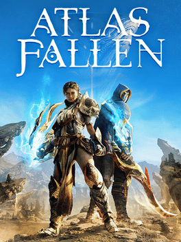
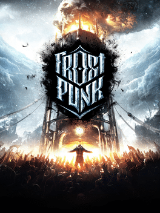
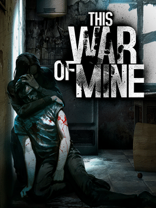

# Game Engine Graveyard
Herein we honor the mighty fallen of proprietary tech

|| Engine | Company | Games |
| --- | :---: | :---: | --- |
|:skull:| CATHODE Engine | Creative Assembly |  |
|:skull:| Fledge Engine | Deck13 |  |
|:skull:| Foundation | Crystal Dynamics |   |
|:skull:| Illusion Engine | Hangar 13 |  |
|:skull:| Liquid Engine | 11bit Studios |   |
|:skull:| NTT | Tt Games |  |
|:skull:| REDEngine | CD Projekt Red |    |
|:skull:| Slipspace Engine | 343 Industries | |
|:skull:| X-Ray Engine | GSC Game World |  |
